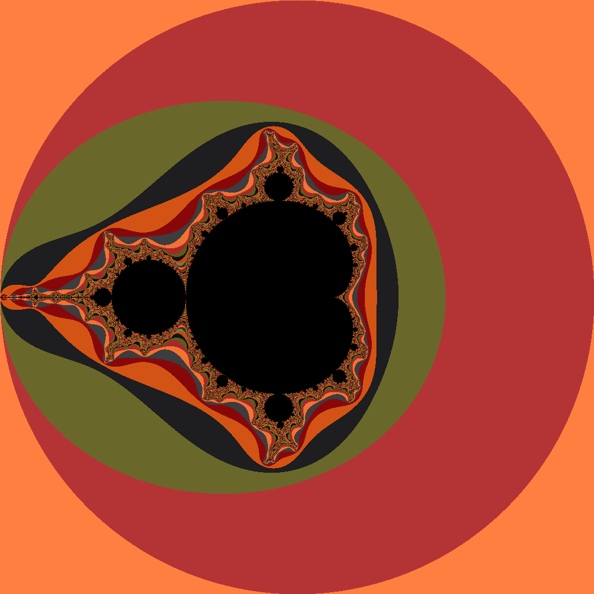

# Exercise 3.5

Implement a full color `Mandelbrot` set using  the function `image.NewRGBA` and the type `color.RGBA` or `color.YCbCr`.

## Image generated

Here is the image generated running for `255` iterations with a contrast of `75`:

