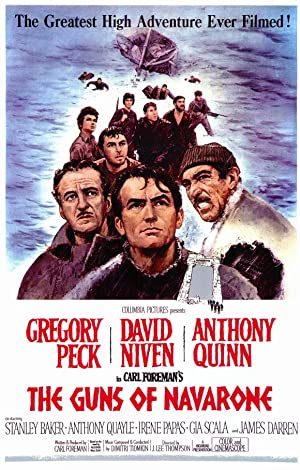
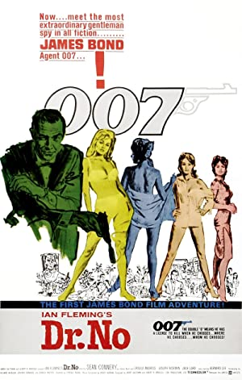

# Exercise 4.13 from The Go Programming Language

The `JSON` based web service of the `Open Movie Database` lets you search https://omdbapi.com/ for a movie by name and download its poster image. Write a tool poster that downloads the poster image for the movie named on the command line.

## OMDB - The Open Movie Database

`The Open Movie Database API` is a RESTful web service to obtain movie information from `IMDB`. All it needs is an `apikey` which can be obtained free by registering with their site. `OMDB Api` have generously made the service available for free.

Once we obtain the `apikey`, looking for the movie information is as simple as the below call.

```html
http://www.omdbapi.com/?apikey=<apikey_value>&t=<movie_name>
```

### Response from omdb

`ombd` provides a search by title api, which we will be using in this exercise. A typical response from the search api will be a `json` data matching the below format:

```json
{
  "Title": "The Guns of Navarone",
  "Year": "1961",
  "Rated": "TV-PG",
  "Released": "28 Apr 1961",
  "Runtime": "158 min",
  "Genre": "Action, Adventure, Drama, War",
  "Director": "J. Lee Thompson",
  "Writer": "Alistair MacLean (novel), Carl Foreman (written for the screen by)",
  "Actors": "Gregory Peck, David Niven, Anthony Quinn, Stanley Baker",
  "Plot": "A British team is sent to cross occupied Greek territory and destroy the massive German gun emplacement that commands a key sea channel.",
  "Language": "English, Greek, German, Latin",
  "Country": "UK, USA",
  "Awards": "Won 1 Oscar. Another 3 wins & 12 nominations.",
  "Poster": "https://m.media-amazon.com/images/M/MV5BMDIyNDA3NGMtNWFmMi00NDRlLWEzMTEtOGIxMDZhZmRmYjJlXkEyXkFqcGdeQXVyNjUwNzk3NDc@._V1_SX300.jpg",
  "Ratings": [
    {
      "Source": "Internet Movie Database",
      "Value": "7.5/10"
    },
    {
      "Source": "Rotten Tomatoes",
      "Value": "92%"
    }
  ],
  "Metascore": "N/A",
  "imdbRating": "7.5",
  "imdbVotes": "45,276",
  "imdbID": "tt0054953",
  "Type": "movie",
  "DVD": "N/A",
  "BoxOffice": "N/A",
  "Production": "Columbia Pictures Corporation, Highroad, Open Road",
  "Website": "N/A",
  "Response": "True"
}
```

## poster.go

`poster.go` takes the required parameters `apikey` and the `movie name` as per the contract and fetches the movie information, parses the `json` data for `poster` link and fetches the same from it's link and stores it locally as per the exercise. In case if the movie title contains spaces, we will convert the spaces to `_` and write to file system.

### Examples

Here are a couple of examples:

1. Search for *Interstellar* movie.

```bash
⇒  go run poster.go 1a678916 "Interstellar"
INFO[0000] initiating movie title query from omdb db @ https://omdbapi.com/?apikey=1a678916&t=Interstellar
INFO[0000] movie information retrieved: main.Movie{Title:"Interstellar", Year:"2014", Poster:"https://m.media-amazon.com/images/M/MV5BZjdkOTU3MDktN2IxOS00OGEyLWFmMjktY2FiMmZkNWIyODZiXkEyXkFqcGdeQXVyMTMxODk2OTU@._V1_SX300.jpg", Response:"True", Actors:"Ellen Burstyn, Matthew McConaughey, Mackenzie Foy, John Lithgow", Plot:"A team of explorers travel through a wormhole in space in an attempt to ensure humanity's survival.", Error:""}
INFO[0000] fetching the poster from https://m.media-amazon.com/images/M/MV5BZjdkOTU3MDktN2IxOS00OGEyLWFmMjktY2FiMmZkNWIyODZiXkEyXkFqcGdeQXVyMTMxODk2OTU@._V1_SX300.jpg
```

The above fetches and stores the below movie poster.


2. Search for *Raiders of the Lost Ark* movie.

```bash
⇒  go run poster.go 1a678916 "Raiders Of The Lost Ark"
INFO[0000] initiating movie title query from omdb db @ https://omdbapi.com/?apikey=1a678916&t=Raiders+Of+The+Lost+Ark
INFO[0000] movie information retrieved: main.Movie{Title:"Indiana Jones and the Raiders of the Lost Ark", Year:"1981", Poster:"https://m.media-amazon.com/images/M/MV5BMjA0ODEzMTc1Nl5BMl5BanBnXkFtZTcwODM2MjAxNA@@._V1_SX300.jpg", Response:"True", Actors:"Harrison Ford, Karen Allen, Paul Freeman, Ronald Lacey", Plot:"In 1936, archaeologist and adventurer Indiana Jones is hired by the U.S. government to find the Ark of the Covenant before Adolf Hitler's Nazis can obtain its awesome powers.", Error:""}
INFO[0000] fetching the poster from https://m.media-amazon.com/images/M/MV5BMjA0ODEzMTc1Nl5BMl5BanBnXkFtZTcwODM2MjAxNA@@._V1_SX300.jpg
```

The above fetches and stores the below movie poster.


3. Search for *Non existent* movie.

We will end up with an error as below and nothing is written to the image file.

```bash
⇒  go run poster.go 1a678916 "omdbapi"
INFO[0000] initiating movie title query from omdb db @ https://omdbapi.com/?apikey=1a678916&t=omdbapi
INFO[0000] movie information retrieved: main.Movie{Title:"", Year:"", Poster:"", Response:"False", Actors:"", Plot:"", Error:"Movie not found!"}
INFO[0000] fetching the poster from
error calling : Get "": unsupported protocol scheme ""ERRO[0000] error writing 'Get "": unsupported protocol scheme ""'
```

4. Search for the classic "The Guns of Navarone".

```bash
⇒  go run poster.go 1a678916 "Guns of Navarone"
INFO[0000] initiating movie title query from omdb db @ https://omdbapi.com/?apikey=1a678916&t=Guns+of+Navarone
INFO[0000] movie information retrieved: main.Movie{Title:"The Guns of Navarone", Year:"1961", Poster:"https://m.media-amazon.com/images/M/MV5BMDIyNDA3NGMtNWFmMi00NDRlLWEzMTEtOGIxMDZhZmRmYjJlXkEyXkFqcGdeQXVyNjUwNzk3NDc@._V1_SX300.jpg", Response:"True", Actors:"Gregory Peck, David Niven, Anthony Quinn, Stanley Baker", Plot:"A British team is sent to cross occupied Greek territory and destroy the massive German gun emplacement that commands a key sea channel.", Error:""}
INFO[0000] fetching the poster from https://m.media-amazon.com/images/M/MV5BMDIyNDA3NGMtNWFmMi00NDRlLWEzMTEtOGIxMDZhZmRmYjJlXkEyXkFqcGdeQXVyNjUwNzk3NDc@._V1_SX300.jpg
```
This fetches and stores the below movie poster.



1. Not the least, lets search for the classic `007` movie *Dr. No*.

Because of the space between `.` and the second name, the file gets stored as `Dr._No.jpg`.
   
```bash
⇒  go run poster.go 1a678916 "Dr. No"
INFO[0000] initiating movie title query from omdb db @ https://omdbapi.com/?apikey=1a678916&t=Dr.+No
INFO[0003] movie information retrieved: main.Movie{Title:"Dr. No", Year:"1962", Poster:"https://m.media-amazon.com/images/M/MV5BMWRkZTI4NzktYjA4Yi00ZjE0LTgzOWQtYzJlMTkyOTU1ODRmXkEyXkFqcGdeQXVyNDY2MTk1ODk@._V1_SX300.jpg", Response:"True", Actors:"Sean Connery, Ursula Andress, Joseph Wiseman, Jack Lord", Plot:"A resourceful British government agent seeks answers in a case involving the disappearance of a colleague and the disruption of the American space program.", Error:""}
INFO[0003] fetching the poster from https://m.media-amazon.com/images/M/MV5BMWRkZTI4NzktYjA4Yi00ZjE0LTgzOWQtYzJlMTkyOTU1ODRmXkEyXkFqcGdeQXVyNDY2MTk1ODk@._V1_SX300.jpg
```

This fetches and stores the below movie poster.

